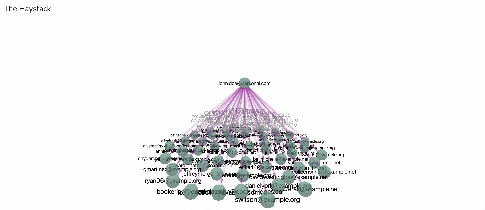

# Email Network Analysis with Neo4j

This project explores complex email communication networks using Neo4j, a graph database well-suited for representing and analyzing relationships between entities. The primary goal is to prioritize the review of the strongest relationships within an email network, which likely contain the most relevant information for evaluation.





## Overview

The project focuses on:

- **Data Generation:** Creating realistic email datasets with different categories (work, personal, spam) and controlled distribution of senders and recipients.
- **Data Ingestion:** Importing the generated email data into Neo4j.
- **Tiering Algorithm:** Implementing a custom algorithm to categorize email addresses into tiers based on their communication directionality with a central email address.
- **Analysis and Visualization:** Using NeoDash to create interactive dashboards for email network analysis.

## Key Components

1. **Data Generation Scripts:**
   - `generate_email_network_dataset.py`: Generates a basic email network dataset.
   - `generate_email_network_crime_dataset.py`: Creates a more complex dataset including simulated criminal activities.

2. **Neo4j Database:** Stores and processes the email network data.

3. **NeoDash Dashboard:** Provides interactive visualizations and analysis tools (`NeoDashDashboard_EmailNetworkAnalysis.json`).

4. **Analysis Algorithms:** Custom Cypher queries for tiering and prioritizing email communications.

## Setup Instructions

1. **Prerequisites:**
   - Python 3.x
   - Neo4j Aura or Neo4j Browser
   - NeoDash (for visualization)

2. **Installation:**

   ```bash
   git clone https://github.com/your-repo/neo-tiering-algorithm.git
   cd neo-tiering-algorithm
   pip install -r requirements.txt
   ```

3. **Generate Dataset:**

   ```bash
   python generate_email_network_dataset.py
   # or for the crime dataset
   python generate_email_network_crime_dataset.py
   ```

4. **Data Ingestion:**
   - Start your Neo4j Aura instance or open Neo4j Browser.
   - Use the following Cypher query to import the generated CSV file:

     ```cypher
     LOAD CSV WITH HEADERS FROM 'file:///path/to/your/csv/file.csv' AS row
     MERGE (sender:Email {address: row.sender})
     MERGE (recipient:Email {address: row.recipient})
     CREATE (sender)-[:SENT {
         id: row.email,
         date: datetime(row.date),
         subject: row.subject,
         labels: row.labels
     }]->(recipient)
     ```

5. **NeoDash Setup:**
   - Import the `NeoDashDashboard_EmailNetworkAnalysis.json` file into NeoDash.

## Usage Guide

1. **Generating Data:**
   - Customize the data generation scripts to adjust the distribution of email types, number of emails, or to add specific patterns you want to analyze.
   - In `generate_email_network_dataset.py`, you can modify:
     - The `labels` list to change email categories.
     - The `distribution` dictionary to adjust the proportion of emails in each category.
     - The `num_records` parameter in the `generate_dataset` function call to change the total number of emails generated.

2. **Running Analysis:**
   - Use the provided Cypher queries in the Neo4j Browser to perform tiering and analysis.
   - Tiering Algorithm:

     ```cypher
     MATCH (john:Email {address: 'john.doe@personal.com'})
     CALL {
         WITH john
         MATCH (john)-[sentByJohn:SENT]->(target:Email)
         WITH john, target, count(sentByJohn) AS countSentByJohn
         OPTIONAL MATCH (target)-[sentToJohn:SENT]->(john)
         WITH john, target.address AS communicantEmailAddress, 
              CASE 
                  WHEN countSentByJohn > 0 AND count(sentToJohn) > 0 THEN 1
                  WHEN countSentByJohn > 0 AND count(sentToJohn) = 0 THEN 2
                  ELSE 3
              END AS tier,
              countSentByJohn,
              count(sentToJohn) AS countSentToJohn,
              countSentByJohn + count(sentToJohn) AS totalCountOfEmailInteractions,
              CASE
                  WHEN countSentByJohn = 0 OR count(sentToJohn) = 0 THEN 0
                  ELSE toFloat(CASE WHEN countSentByJohn < count(sentToJohn) 
                                    THEN countSentByJohn 
                                    ELSE count(sentToJohn) 
                               END) / 
                       CASE WHEN countSentByJohn > count(sentToJohn) 
                            THEN countSentByJohn 
                            ELSE count(sentToJohn) 
                       END
              END AS communicationBalanceRatio
         RETURN communicantEmailAddress, tier, countSentByJohn, countSentToJohn, totalCountOfEmailInteractions, communicationBalanceRatio
         ORDER BY tier ASC, 
                  countSentByJohn DESC, 
                  countSentToJohn DESC, 
                  totalCountOfEmailInteractions DESC,
                  communicationBalanceRatio DESC
     }
     RETURN *
     ```

3. **Visualization with NeoDash:**
   - Open the imported dashboard in NeoDash.
   - Use the interactive components to explore the email network, focusing on:
     - The Haystack: Overview of the entire email network.
     - The Needle: Tiered communication network highlighting strongest bi-directional communicants.
     - Priority Scoring: Identifying high-priority communications based on recency, balance, and frequency.

## NeoDash Integration

The NeoDash dashboard (`NeoDashDashboard_EmailNetworkAnalysis.json`) provides several key visualizations. Here are the components along with their respective queries:

1. **The Haystack:**
   A 3D graph representation of the entire email network.

   ```cypher
   MATCH (source:Email {address: $neodash_email_address})
   MATCH (source)-[r:SENT]-(other:Email)
   WITH source, other, count(r) AS emailCount
   ORDER BY emailCount DESC
   LIMIT 50
   WITH source, collect({node: other, count: emailCount}) AS topConnections
   UNWIND topConnections AS connection
   CALL apoc.create.vRelationship(source, "CONNECTS_TO", {count: connection.count}, connection.node) YIELD rel AS vrel
   RETURN source, 
          [conn IN topConnections | conn.node] AS connectedEmails, 
          collect(vrel) AS relationships
   ```

2. **The Needle:**
   A tiered view of the communication network, focusing on the strongest relationships.

   ```cypher
   MATCH (source:Email { address: $neodash_email_address })
   WITH source
   OPTIONAL MATCH (source)-[rtier1:SENT]->(tier1:Email)-[r2tier1:SENT]->(source)
   WITH source, collect(DISTINCT tier1)[..50] as tier1_nodes 
   OPTIONAL MATCH (source)-[rtier2:SENT]->(tier2:Email)
   WHERE NOT EXISTS ((tier2)-[:SENT]->(source))
   WITH source, tier1_nodes, collect(DISTINCT tier2)[..50] as tier2_nodes
   OPTIONAL MATCH (tier3:Email)-[rtier3:SENT]->(source)
   WHERE NOT EXISTS ((source)-[:SENT]->(tier3))
   WITH source, tier1_nodes, tier2_nodes, collect(DISTINCT tier3)[..50] as tier3_nodes
   CALL apoc.create.vNode(['Tier1', 'Email'], {address: 'Tier1Intermediate', score: 1}) YIELD node AS intermediateNodeTier1
   CALL apoc.create.vNode(['Tier2', 'Email'], {address: 'Tier2Intermediate', score: 1}) YIELD node AS intermediateNodeTier2
   CALL apoc.create.vNode(['Tier3', 'Email'], {address: 'Tier3Intermediate', score: 1}) YIELD node AS intermediateNodeTier3
   CALL apoc.create.vRelationship(source, 'SENT', {}, intermediateNodeTier1) YIELD rel as vrelSourceToIntermediateTier1
   CALL apoc.create.vRelationship(source, 'SENT', {}, intermediateNodeTier2) YIELD rel as vrelSourceToIntermediateTier2
   CALL apoc.create.vRelationship(source, 'SENT', {}, intermediateNodeTier3) YIELD rel as vrelSourceToIntermediateTier3
   WITH *, 
        [tier1 IN tier1_nodes | apoc.create.vRelationship(intermediateNodeTier1, 'SENT', {}, tier1)] as vrelIntermediateToTier1s,
        [tier2 IN tier2_nodes | apoc.create.vRelationship(intermediateNodeTier2, 'SENT', {}, tier2)] as vrelIntermediateToTier2s,
        [tier3 IN tier3_nodes | apoc.create.vRelationship(intermediateNodeTier3, 'SENT', {}, tier3)] as vrelIntermediateToTier3s
   RETURN 
       source, 
       vrelSourceToIntermediateTier1, intermediateNodeTier1, vrelIntermediateToTier1s, tier1_nodes,
       vrelSourceToIntermediateTier2, intermediateNodeTier2, vrelIntermediateToTier2s, tier2_nodes,
       vrelSourceToIntermediateTier3, intermediateNodeTier3, vrelIntermediateToTier3s, tier3_nodes
   ```

3. **Communicant Tier Breakdown:**
   Pie chart showing the distribution of communicants across tiers.

   ```cypher
   MATCH (john:Email {address: 'john.doe@personal.com'})
   CALL {
       WITH john
       MATCH (john)-[sentByJohn:SENT]->(target:Email)
       WITH john, target, count(sentByJohn) AS countSentByJohn
       OPTIONAL MATCH (target)-[sentToJohn:SENT]->(john)
       WITH john, target, countSentByJohn, count(sentToJohn) AS countSentToJohn
       WITH CASE 
                WHEN countSentByJohn > 0 AND countSentToJohn > 0 THEN 1
                WHEN countSentByJohn > 0 AND countSentToJohn = 0 THEN 2
                ELSE 3
            END AS tier
       RETURN tier, count(*) AS count
       UNION
       MATCH (sender:Email)-[:SENT]->(john)
       WHERE NOT EXISTS((john)-[:SENT]->(sender))
       RETURN 3 AS tier, count(*) AS count
   }
   RETURN tier, sum(count) AS totalCount
   ORDER BY tier
   ```

4. **Daily Communication Frequency:**
   Bar chart displaying communication patterns over time.

   ```cypher
   MATCH (john:Email {address: 'john.doe@personal.com'})
   CALL {
       MATCH (john)-[sent:SENT]->()
       RETURN date(datetime({epochMillis: toInteger(sent.date)})) AS date
       UNION ALL
       MATCH ()-[received:SENT]->(john)
       RETURN date(datetime({epochMillis: toInteger(received.date)})) AS date
   }
   WITH date, count(*) AS count
   RETURN toString(date) AS category, count AS value
   ORDER BY date
   ```

5. **High-Priority Communicant Messages:**
   Detailed table of important communications.

   ```cypher
   MATCH (john:Email {address: 'john.doe@personal.com'})
   CALL {
       WITH john
       MATCH (john)-[sentByJohn:SENT]->(target:Email)
       WITH john, target, count(sentByJohn) AS countSentByJohn
       OPTIONAL MATCH (target)-[sentToJohn:SENT]->(john)
       WITH john, target.address AS communicantEmailAddress, 
            CASE 
                WHEN countSentByJohn > 0 AND count(sentToJohn) > 0 THEN 1
                WHEN countSentByJohn > 0 AND count(sentToJohn) = 0 THEN 2
                ELSE 3
            END AS tier,
            countSentByJohn,
            count(sentToJohn) AS countSentToJohn,
            countSentByJohn + count(sentToJohn) AS totalCountOfEmailInteractions,
            CASE
                WHEN countSentByJohn = 0 OR count(sentToJohn) = 0 THEN 0
                ELSE toFloat(CASE WHEN countSentByJohn < count(sentToJohn) 
                                  THEN countSentByJohn 
                                  ELSE count(sentToJohn) 
                             END) / 
                     CASE WHEN countSentByJohn > count(sentToJohn) 
                          THEN countSentByJohn 
                          ELSE count(sentToJohn) 
                     END
            END AS communicationBalanceRatio
       RETURN communicantEmailAddress, tier, countSentByJohn, countSentToJohn, totalCountOfEmailInteractions, communicationBalanceRatio
       ORDER BY tier ASC, 
                countSentByJohn DESC, 
                countSentToJohn DESC, 
                totalCountOfEmailInteractions DESC,
                communicationBalanceRatio DESC
       LIMIT 10
   }
   WITH john, communicantEmailAddress
   MATCH (communicant:Email {address: communicantEmailAddress})
   CALL {
       WITH john, communicant
       MATCH (john)-[sent:SENT]->(communicant)
       RETURN sent.date AS datetime, sent.subject AS subject, sent.labels AS labels, 'Sent' AS direction
       UNION ALL
       MATCH (communicant)-[received:SENT]->(john)
       RETURN received.date AS datetime, received.subject AS subject, received.labels AS labels, 'Received' AS direction
   }
   RETURN 
       communicantEmailAddress, 
       datetime({epochMillis: toInteger(datetime)}) AS datetime,
       subject,
       labels,
       direction
   ORDER BY communicantEmailAddress, datetime DESC
   LIMIT 100
   ```

6. **Priority Scoring:**
   Advanced analysis for identifying critical communications.

   ```cypher
   MATCH (john:Email {address: 'john.doe@personal.com'})
   CALL {
       WITH john
       MATCH (john)-[sentByJohn:SENT]->(target:Email)
       WITH john, target, collect(sentByJohn) AS sentByJohnList
       OPTIONAL MATCH (target)-[sentToJohn:SENT]->(john)
       WITH john, target, sentByJohnList, collect(sentToJohn) AS sentToJohnList
       WITH john, target.address AS communicantEmailAddress, 
            sentByJohnList,
            sentToJohnList,
            size(sentByJohnList) AS countSentByJohn,
            size(sentToJohnList) AS countSentToJohn
       WITH communicantEmailAddress, sentByJohnList, sentToJohnList,
            countSentByJohn, countSentToJohn,
            countSentByJohn + countSentToJohn AS totalInteractions,
            CASE 
                WHEN countSentByJohn > 0 AND countSentToJohn > 0 THEN 1
                WHEN countSentByJohn > 0 AND countSentToJohn = 0 THEN 2
                ELSE 3
            END AS tier,
            CASE
                WHEN countSentByJohn = 0 OR countSentToJohn = 0 THEN 0
                ELSE toFloat(CASE WHEN countSentByJohn < countSentToJohn 
                                  THEN countSentByJohn 
                                  ELSE countSentToJohn 
                             END) / 
                     CASE WHEN countSentByJohn > countSentToJohn 
                          THEN countSentByJohn 
                          ELSE countSentToJohn 
                     END
            END AS communicationBalanceRatio
       WITH *, 
            [email IN sentByJohnList | toFloat(email.date)] AS sentDates,
            [email IN sentToJohnList | toFloat(email.date)] AS receivedDates
       WITH *, 
            size([d IN sentDates WHERE d >= toFloat(datetime().epochMillis) - 30 * 24 * 60 * 60 * 1000]) +
            size([d IN receivedDates WHERE d >= toFloat(datetime().epochMillis) - 30 * 24 * 60 * 60 * 1000]) AS recentInteractions,
            CASE WHEN size(sentDates) > 1 
                 THEN reduce(s = 0.0, i IN range(1, size(sentDates)-1) | 
                      s + (sentDates[i] - sentDates[i-1]) / 3600000.0) / (size(sentDates)-1)
                 ELSE null 
            END AS avgTimeBetweenSent,
            CASE WHEN size(receivedDates) > 1 
                 THEN reduce(s = 0.0, i IN range(1, size(receivedDates)-1) | 
                      s + (receivedDates[i] - receivedDates[i-1]) / 3600000.0) / (size(receivedDates)-1)
                 ELSE null 
            END AS avgTimeBetweenReceived
       WITH *,
            [email IN sentByJohnList | email.subject] AS sentSubjects,
            [email IN sentToJohnList | email.subject] AS receivedSubjects,
            [email IN sentByJohnList | email.labels] AS sentLabels,
            [email IN sentToJohnList | email.labels] AS receivedLabels
       RETURN communicantEmailAddress, 
              tier, 
              countSentByJohn, 
              countSentToJohn,
              totalInteractions,
              communicationBalanceRatio,
              recentInteractions,
              avgTimeBetweenSent,
              avgTimeBetweenReceived,
              sentSubjects,
              receivedSubjects,
              sentLabels,
              receivedLabels,
              (toFloat(recentInteractions) / totalInteractions * 100) +
              (communicationBalanceRatio * 50) +
              (CASE WHEN avgTimeBetweenSent IS NOT NULL AND avgTimeBetweenSent < 24 THEN 50 ELSE 0 END) +
              (CASE WHEN avgTimeBetweenReceived IS NOT NULL AND avgTimeBetweenReceived < 24 THEN 50 ELSE 0 END) +
              (CASE WHEN any(label IN sentLabels WHERE label CONTAINS 'urgent' OR label CONTAINS 'important') THEN 30 ELSE 0 END) +
              (CASE WHEN any(label IN receivedLabels WHERE label CONTAINS 'urgent' OR label CONTAINS 'important') THEN 30 ELSE 0 END) AS priorityScore
   }
   RETURN *
   ORDER BY priorityScore DESC
   LIMIT 20
   ```

To use the dashboard:

1. Import the JSON file into NeoDash.
2. Connect it to your Neo4j Aura instance or Neo4j Browser containing the email network data.
3. Interact with the visualizations to gain insights into the email network structure and identify important relationships.

## Advanced Usage and Customization

### Modifying the Tiering Algorithm

The tiering algorithm can be adjusted to fit specific analysis needs. Here are some ways to customize it:

1. **Changing Tier Thresholds:** Modify the CASE statement in the tiering query to adjust how emails are categorized into tiers.
2. **Adding More Tiers:** Expand the CASE statement to include additional tiers based on more granular communication patterns.
3. **Incorporating Time-based Factors:** Include conditions based on the recency or frequency of communications to influence tier assignments.

### Enhancing Data Generation

To create more realistic or specific datasets:

1. **Add More Email Types:** Expand the `labels` list in the data generation scripts to include additional categories.
2. **Implement Complex Patterns:** Modify the `generate_email_record` function to create specific communication patterns or scenarios.
3. **Increase Dataset Size:** Adjust the `num_records` parameter to generate larger datasets for more comprehensive analysis.

### Optimizing Neo4j Queries

For better performance with large datasets:

1. **Index Creation:** Create indexes on frequently queried properties:

   ```cypher
   CREATE INDEX ON :Email(address);
   ```

2. **Query Optimization:** Use EXPLAIN and PROFILE in Neo4j Browser to analyze and optimize complex queries.
3. **Batching:** For large data imports or updates, use batched operations to improve performance.

## Troubleshooting

Common issues and their solutions:

1. **Data Import Failures:**
   - Ensure CSV file paths are correct and accessible to Neo4j.
   - Check CSV file format and encoding (UTF-8 recommended).

2. **NeoDash Visualization Issues:**
   - Verify that the Neo4j connection details in NeoDash are correct.
   - Ensure APOC procedures are installed and allowed in your Neo4j instance.

3. **Performance Problems:**
   - For large datasets, consider using Neo4j's `PERIODIC COMMIT` for imports.
   - Optimize queries using EXPLAIN/PROFILE and add necessary indexes.

## Contributing

Contributions to improve the analysis algorithms, data generation methods, or NeoDash visualizations are welcome. Please follow these steps:

1. Fork the repository.
2. Create a new branch for your feature (`git checkout -b feature/AmazingFeature`).
3. Commit your changes (`git commit -m 'Add some AmazingFeature'`).
4. Push to the branch (`git push origin feature/AmazingFeature`).
5. Open a Pull Request.

Please ensure your code adheres to the project's coding standards and includes appropriate tests and documentation.

## License

Distributed under the MIT License. See `LICENSE` for more information.

## Acknowledgments

- Neo4j for providing a powerful graph database platform.
- NeoDash creators for the visualization dashboard tool.
- [Any other acknowledgments or credits]
